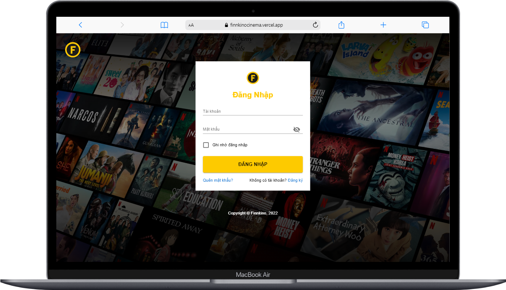
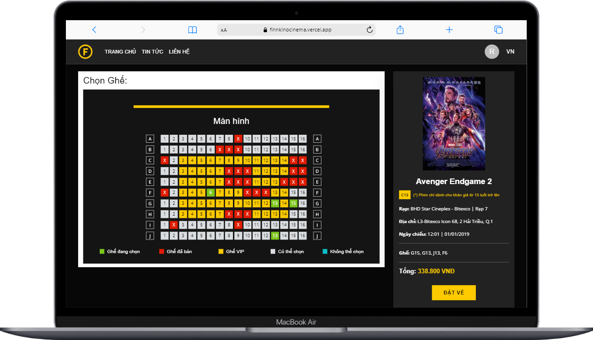
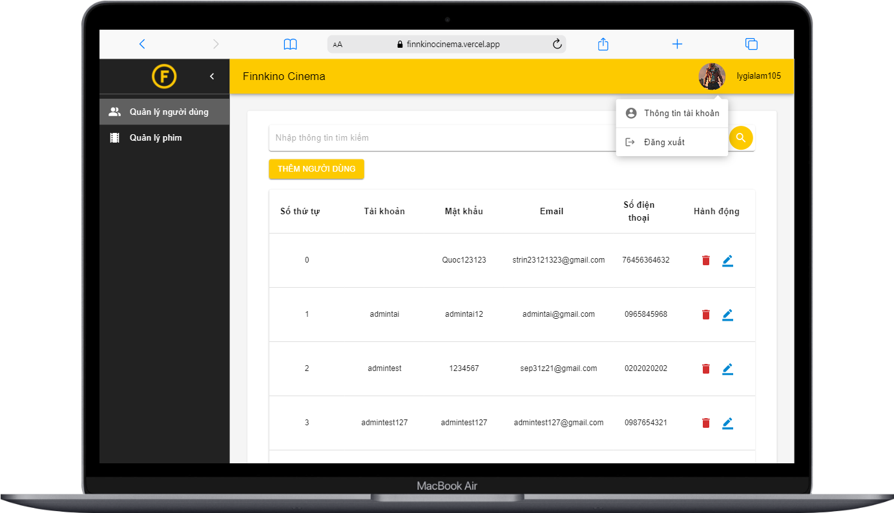
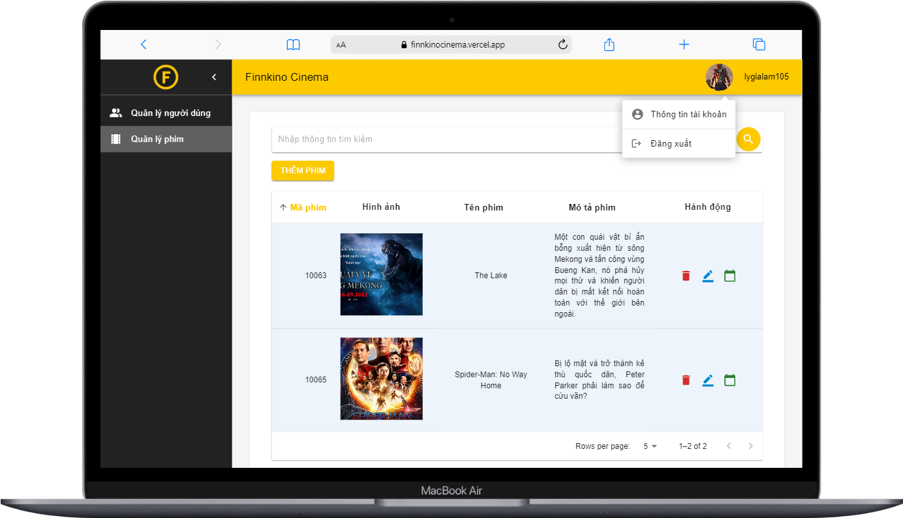
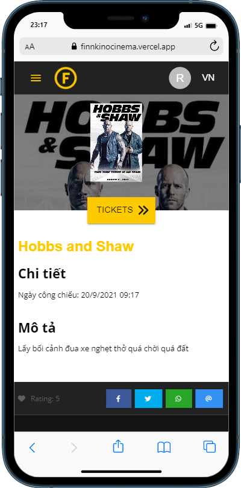
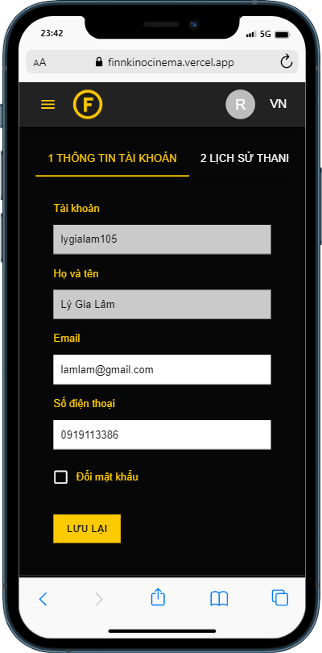

# Finnkino Cinema

A movie ticket booking website built with ReacJS, Redux and Material UI.

See the **live demo** -> [Finnkino Cinema](https://finnkinocinema.vercel.app "Finnkino Cinema") 🎫

## Tech Stack

![Tech logos][stack]

- [ReactJS][reactjs]: JavaScript library for building user interfaces.
- [Redux][redux]: state management with **Thunk middleware**.
- [Material UI][mui]: React-based UI component library.
- [SCSS/Sass][sass]: CSS pre-processor for styling the website.
- [React Hook Form][react-hook-form] | [Formik][formik]: form state management and validation.

[stack]: src/assets/docs-images/finnkino-tech-stack.png
[reactjs]: https://reactjs.org/
[redux]: https://redux.js.org/
[mui]: https://mui.com/
[sass]: https://sass-lang.com/
[react-hook-form]: https://react-hook-form.com/
[formik]: https://formik.org/docs/overview

<!-- ## Tasks

> 19 Jun - 13 Aug, 2022

Our main tasks in the project are to implement:

- [x] Homepage layout
- [x] Responsive design
- [x] Full effects
- [x] Themes: light and dark

Task assignments: check out checklist.xlsx for more details. -->

<!-- ## Project Structure

```
$PROJECT_ROOT
│   # Resource files
├── assets
│   │   # Image file
│   ├── images
│   │   # Javascript file
│   ├── scripts
│   │   # CSS file
│   ├── styles
│   │   # Third party plugins
│   └── vendors
│   # Screenshots of the project
├── screenshots
│   # Roadmap of the project
├── checklist.xlsx
│   # Page content
└── index.html
``` -->

## Installation and Run

Check out the website -> [Finnkino Cinema](https://finnkinocinema.vercel.app "Finnkino Cinema") or run locally:

#### Clone the project

`git clone https://github.com/scoobytux/movielab.git`

`cd movielab`

#### Install dependencies

`npm install`

#### Run the development server

`npm start`

Open http://localhost:3000 with your browser to see the result.

## Some Project's Views on Devices

- On MacBook/Laptop









- On Mobile

<div style="display: flex; flex-wrap: wrap; gap: 15px;">
  
  
</div>

## Contributors

Thanks goes to these wonderful people ✨

<!-- ALL-CONTRIBUTORS-LIST:START -->
<!-- prettier-ignore-start -->
<!-- markdownlint-disable -->
<table>
  <tr>
    <!-- Phuong Vu -->
    <td align="center"><a href="https://github.com/phuongvu0804"><br /><sub><b>Phuong Vu (Chloe)</b></sub></a><br /><a href="https://github.com/scoobytux/movielab/commits?author=phuongvu0804" title="Code">💻</a><a href="https://github.com/scoobytux/movielab/commits?author=phuongvu0804" title="Documentation">📖</a></td>
    <!-- Tu Le -->
    <td align="center"><a href="https://github.com/scoobytux"><br /><sub><b>Tu Le (Liam)</b></sub></a><br /><a href="https://github.com/scoobytux/movielab/commits?author=scoobytux" title="Code">💻</a><a href="https://github.com/scoobytux/movielab/commits?author=scoobytux" title="Documentation">📖</a></td>
  </tr>
</table>
<!-- markdownlint-restore -->
<!-- prettier-ignore-end -->

<!-- ALL-CONTRIBUTORS-LIST:END -->

## Credits and Reference

| Resource                       | Description                                                                     |
| ------------------------------ | ------------------------------------------------------------------------------- |
| [CyberSoft Academy][cybersoft] | API provider                                                                    |
| [Finnkino][finnkino]           | A cool Finnish website for booking online movie tickets we got inspiration from |

[cybersoft]: https://cybersoft.edu.vn/
[finnkino]: https://www.finnkino.fi/en/
